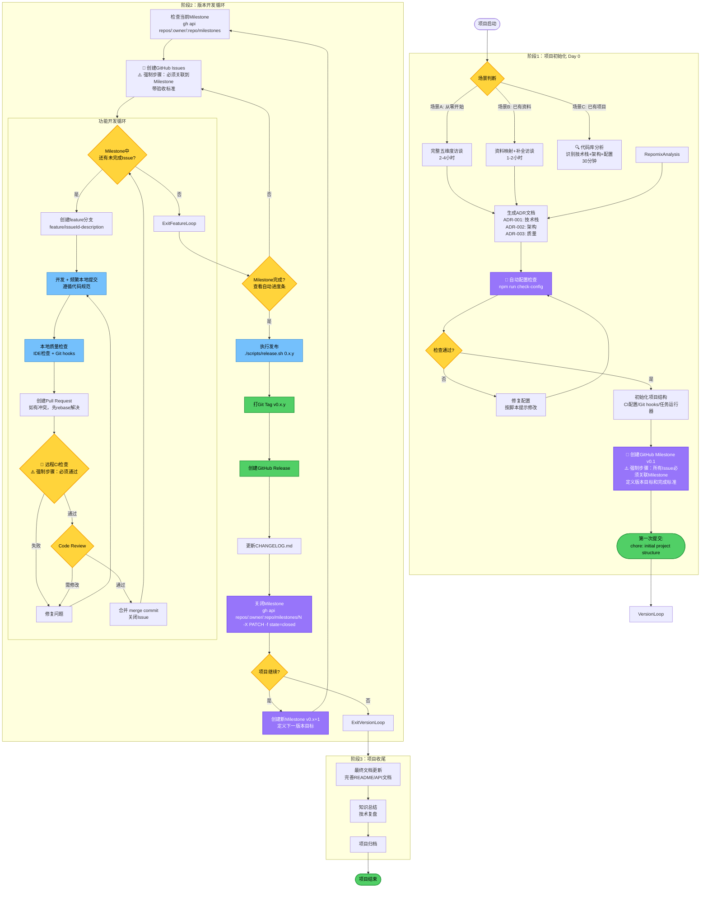
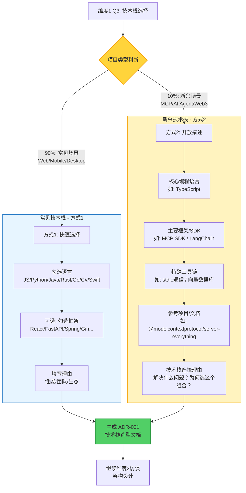
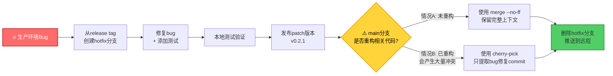

# 项目开发黄金流程 - 通用版 v3.4

> **"Bad programmers worry about the code. Good programmers worry about data structures and their relationships."** - Linus Torvalds
>
> **应用到项目管理：** "Bad processes write fixed documents. Good processes generate project-specific documents."

---

## 目录

- [完整流程图](#完整流程图)
- [第零部分：项目启动前的技术决策流程](#第零部分项目启动前的技术决策流程)
- [第一部分：核心理念与哲学](#第一部分核心理念与哲学)
- [第二部分：版本与任务管理体系 (GitHub Milestone)](#第二部分版本与任务管理体系-github-milestone)
- [第三部分：Git 核心工作流](#第三部分git-核心工作流)
- [第四部分：工程奠基与自动化](#第四部分工程奠基与自动化)
- [第五部分：核心开发实践](#第五部分核心开发实践)
- [第六部分：文档与总结](#第六部分文档与总结)
- [附录：技术栈特定实践](#附录技术栈特定实践)
- [附录：GitHub CLI 命令参考](#附录github-cli-命令参考)
- [快速启动检查清单](#快速启动检查清单)

---

## 完整流程图



---

## ⚠️ 流程执行铁律

**🔴 绝对不允许跳过任何流程步骤**

- **AI 执行者必读**：无论用户如何描述任务，都必须严格按照上述流程图执行，不得跳过任何步骤。
- **用户描述可能有误**：用户可能会说"直接创建 Issue"、"跳过 Milestone"等，这些都是错误的指令。
- **流程图已标注关键节点**：带有 🔴 标记的节点是强制步骤，不可省略。

**记住**：流程设计已经考虑了所有最佳实践和常见陷阱。信任流程，严格执行。

---

## 第零部分：项目启动前的技术决策流程

### 核心理念

**"不解决假想的问题，只解决真实的问题"** - Linus Torvalds

在开始编码前，通过结构化访谈明确项目的技术边界，生成必要的技术文档。**文档是对话的产物，不是凭空想象的教条。**

### 为什么需要这个流程？

```text
❌ 常见错误：直接开始写代码
   → 3 个月后发现架构设计有问题
   → 技术债务累积，重构成本巨大

✅ 正确做法：开发前 1-4 小时的技术决策访谈
   → 明确架构边界、技术栈、质量标准
   → 生成项目特定的技术文档
   → 文档成为开发约束，避免后续混乱
```

### 访谈参与者

- **技术负责人**（必须）
- **核心开发者** 2-3 人（推荐）
- **产品负责人**（可选，理解业务需求）

---

### 使用场景分类

**场景 A：从零开始的新项目**

- 按五维度访谈逐步回答所有问题，生成完整的 ADR 文档集。
- 适用于：新创业项目、全新技术栈探索、概念验证原型。

**场景 B：已有初始资料的项目（最常见）**

- **流程**：收集现有资料 → 映射到五维度框架 → **🔴执行配置完整性审查** → 访谈补全 → 生成 ADR。
- **核心**：此流程的价值在于"结构化已有信息 + 补全缺失 + 消除冲突"，特别是发现和修复"配置债务"。

**场景 C：为已有项目引入规范**

- **流程**：使用repomix mcp 工具分析代码库 → 生成现状 ADR → 渐进式配置基础设施（CI/Hooks）→ 创建规范化 Milestone。
- **核心**：通过工具快速了解项目现状，生成改进计划，并以非破坏性的方式逐步引入开发规范。

---

### 五维度技术决策访谈

#### **维度 1：项目定义与技术栈 (WHAT & WHY)**

##### 必答问题

```text
Q1: 用一句话描述这个项目的核心功能？
Q2: 项目类型？ (Web后端/前端, 移动应用, CLI, AI/ML等)
Q3: 主要技术栈是什么？为什么选择它？
```

##### 技术栈选择决策流程



```text
Q4: 项目规模预期？ (代码行数/模块数量)
Q5: 目标平台？ (Web/Mobile/Desktop/Server)
Q6: 是否涉及多语言/跨语言集成？
```

##### 访谈输出 → 生成文档

- **`docs/architecture/ADR-001-Tech-Stack.md`**：记录技术栈选型、理由和后果。
- **`docs/project-structure.md`**：根据项目规模约定目录结构和命名规范。

---

#### **维度 2：架构设计与模块化 (HOW - Architecture)**

- **Q1: 项目是否需要分层架构？** (3层/4层, 通信方式)
- **Q2: 如何处理跨平台/跨环境差异？** (运行时检测/配置文件/条件编译)
- **Q3: 是否需要插件/扩展机制？** (静态/动态, 协议)
- **Q4: 依赖管理策略？** (宽松/统一/严格, 工具)
- **Q5: 模块间通信方式？** (直接调用/消息队列/RPC/REST)
- **Q6: 数据存储方案？** (文件/SQLite/SQL/NoSQL)

##### 访谈输出 → 生成文档

- **`docs/architecture/ADR-002-Architecture-Design.md`**：包含分层架构图、模块划分原则、数据存储方案。
- **`docs/architecture/module-dependencies.md`**：使用 Mermaid 图可视化模块依赖关系。

---

#### **维度 3：质量保障机制 (HOW - Quality)**

- **Q1: 代码风格如何统一？** (格式化工具 + Linter)
- **Q2: 测试策略？** (单元/集成/E2E, 框架)
- **Q3: 测试覆盖率要求？** (>70%/>80%/>90%)
- **Q4: 本地质量门槛？** (脚本/Git hooks/IDE)
- **Q5: CI/CD 质量门槛？** (格式/Lint/测试/安全扫描)
- **Q6: 代码审查规范？** (必须Review, Approve人数)

##### 访谈输出 → 生成文档

- **`docs/quality-guidelines.md`**：定义代码风格、测试策略和本地开发流程。
- **`.github/workflows/ci.yml`**：根据技术栈自动生成 CI 配置文件。

---

#### **维度 4：构建、发布与部署 (HOW - Build & Release)**

- **Q1: 构建工具？** (npm/Poetry/Maven/Cargo)
- **Q2: 目标环境？** (dev/staging/prod, 部署方式)
- **Q3: 版本管理策略？** (SemVer/CalVer)
- **Q4: 发布流程？** (手动/半自动/全自动)
- **Q5: 构建优化需求？** (压缩/Tree shaking/代码分割)
- **Q6: 环境变量与配置管理？** (.env/云平台/密钥服务)

##### 访谈输出 → 生成文档

- **`docs/build-and-release.md`**：包含本地构建、环境配置、版本管理和发布流程。
- **`docs/deployment.md`**：根据部署方式提供具体指南。

---

#### **维度 5：文档规范 (HOW - Documentation)**

- **Q1: 需要哪些文档？** (README/API/ADR/贡献指南)
- **Q2: API 文档如何生成？** (手动/代码注释自动生成)
- **Q3: 架构决策如何记录？** (ADR)
- **Q4: 代码文档要求？** (注释风格/覆盖范围)
- **Q5: 变更日志？** (手动维护/自动生成)
- **Q6: 文档更新策略？** (同步/CI检查)

##### 访谈输出 → 生成文档

- **`docs/documentation-guidelines.md`**：定义文档清单、README 结构、ADR 模板、代码注释规范和 CHANGELOG 格式。
- **`CONTRIBUTING.md`**：为社区贡献者提供指南。

##### ADR 模板标准（Industry Best Practice）

在生成 `docs/documentation-guidelines.md` 时，应包含以下 ADR 模板：

```markdown
# ADR-XXX: [决策标题]

## 状态

[提议 (Proposed) | 已接受 (Accepted) | 已废弃 (Deprecated) | 已替代 by ADR-YYY (Superseded)]

## 日期

YYYY-MM-DD

## 背景 (Context)

[描述需要做决策的问题和当前情况]

- 当前面临的技术挑战是什么？
- 业务/技术约束有哪些？
- 为什么需要做这个决策？

## 决策 (Decision)

[描述选择的解决方案]

我们将采用 [方案名称]，因为 [核心理由]。

## 备选方案 (Alternatives Considered)

### 备选方案 A: [方案名称]

- **描述**: [简要说明方案内容]
- **优势**:
  - [优点1]
  - [优点2]
- **为何未选择**:
  - [具体拒绝理由1: 如性能不足/复杂度过高/维护成本高]
  - [具体拒绝理由2]

### 备选方案 B: [方案名称]

- **描述**: [简要说明方案内容]
- **优势**:
  - [优点1]
  - [优点2]
- **为何未选择**:
  - [具体拒绝理由1]
  - [具体拒绝理由2]

### 备选方案 C: 不做任何改变（保持现状）

- **描述**: 继续使用当前方案
- **优势**:
  - 无需额外开发成本
  - 团队熟悉现有系统
- **为何未选择**:
  - [当前方案的具体问题]
  - [无法满足的需求]

## 后果 (Consequences)

### 正面影响

- [影响1: 如性能提升30%]
- [影响2: 如开发效率提高]
- [影响3: 如维护成本降低]

### 负面影响与缓解措施

- [影响1: 如学习成本] → **缓解**: [措施，如提供培训文档]
- [影响2: 如迁移成本] → **缓解**: [措施，如分阶段迁移]
- [影响3: 如技术风险] → **缓解**: [措施，如PoC验证]

### 所需资源

- 开发时间: [估算]
- 培训成本: [估算]
- 基础设施变更: [列表]

## 示例

**ADR-001: 选择 PostgreSQL 作为主数据库**

### 备选方案 (Alternatives Considered)

**备选方案 A: MongoDB**

- **描述**: 使用 NoSQL 文档数据库
- **优势**:
  - Schema-less 设计，快速迭代
  - 水平扩展容易
- **为何未选择**:
  - 项目需要强一致性事务（ACID）
  - 关系型数据建模更符合业务逻辑
  - 团队对 SQL 更熟悉

**备选方案 B: DynamoDB**

- **描述**: 使用 AWS 托管 NoSQL 数据库
- **优势**:
  - 完全托管，零运维
  - 极低延迟
- **为何未选择**:
  - 成本高（按请求量计费）
  - 供应商锁定风险
  - 复杂查询能力有限

**备选方案 C: SQLite**

- **描述**: 使用嵌入式关系型数据库
- **优势**:
  - 部署简单，无需独立服务器
  - 开发快速
- **为何未选择**:
  - 不支持多用户并发写入
  - 无法满足生产环境扩展需求
```

**为什么需要记录"Alternatives Considered"？** (AWS/Azure/Google 推荐的 ADR 最佳实践)

- ✅ **避免重复讨论**: 新成员提出"为什么不用 MongoDB？"时，直接查看 ADR。
- ✅ **决策可追溯**: 6 个月后需要重新评估时，了解当时的完整考量。
- ✅ **知识传承**: 记录被拒绝方案的理由，防止走弯路。
- ✅ **提高决策质量**: 强制团队考虑多个选项，而非"一拍脑袋"决定。

---

## 第一部分：核心理念与哲学

**实用主义第一**："不解决假想的问题，只解决真实的问题" - Linus Torvalds

- **自动化 > 手动追踪**：质量由工具保证，而非流程文档。
- **代码即真相**：测试是验证手段，而非教条。
- **人的判断 > AI 建议**：AI是强大的副驾驶，但你永远是机长。
- **简洁 > 复杂**：永远寻找最简方案，消除特殊情况。
- **JIT 文档生成 > 预先假设**：通过访谈生成项目特定文档，而非编写适用于所有项目的"百科全书"。

---

## 第二部分：版本与任务管理体系 (GitHub Milestone)

**摒弃易过时的 `NEXT_STEPS.md`，拥抱与代码库集成的 GitHub Milestone，实现战略、战术、执行的无缝联动。**

### 战略层 (GitHub Milestone)：下一个可交付版本的路线图

**作用**：回答"我们要去哪里"，并自动追踪进度。

**规划范围**：

- ✅ 只规划"下一个可交付版本"（通常 1-3 个月）。
- ✅ 明确这个版本的核心目标和**完成标准**。

**创建版本 Milestone：**

```bash
# 创建第一个版本的 Milestone（gh CLI 不支持 milestone 子命令，需使用 API）
gh api repos/:owner/:repo/milestones -X POST \
  -f title="v0.1.0" \
  -f description="核心目标：
  1. 用户认证功能
  2. 数据导入导出

  完成标准：
  - 所有P0 bug修复
  - CI通过率 >95%
  - 核心API文档完成" \
  -f due_on="2025-02-15T23:59:59Z"
```

### 战术层 (GitHub Issues)

**作用**：回答"下一步做什么"，所有开发工作的**单一事实来源**。

- 每个 Issue 必须包含清晰的**验收标准 (Acceptance Criteria)**。
- **必须关联到对应的 Milestone**。

**创建 Issue 并关联 Milestone：**

```bash
gh issue create \
  --title "实现OAuth2登录" \
  --body "实现Google/GitHub OAuth2登录流程" \
  --milestone "v0.1.0" \
  --label "p1,enhancement"
```

#### 标签体系 (GitHub Labels)

**作用**：快速识别 Issue 的优先级和类型，辅助任务分类和过滤。

##### 1. 初始化标准标签

**在项目初始化时（Day 0）执行一次：**

```bash
# 优先级标签 (Priority)
gh label create "p0" --description "紧急：阻塞发布的严重问题" --color "b60205"
gh label create "p1" --description "高优先级：必须在当前版本完成" --color "d93f0b"
gh label create "p2" --description "中优先级：重要但非阻塞" --color "fbca04"
gh label create "p3" --description "低优先级：可延后至下一版本" --color "0e8a16"

# 类型标签 (Type)
gh label create "bug" --description "Bug：功能异常或错误" --color "d73a4a"
gh label create "enhancement" --description "功能增强：新功能或改进" --color "a2eeef"
gh label create "docs" --description "文档：仅文档变更" --color "0075ca"
gh label create "refactor" --description "重构：不改变功能的代码优化" --color "d4c5f9"
gh label create "test" --description "测试：测试相关" --color "bfd4f2"
gh label create "chore" --description "杂项：构建/工具/依赖更新" --color "fef2c0"

# 状态标签 (Status，可选)
gh label create "blocked" --description "阻塞：等待外部依赖" --color "000000"
gh label create "help wanted" --description "需要帮助" --color "008672"
gh label create "duplicate" --description "重复" --color "cfd3d7"
gh label create "wontfix" --description "不修复" --color "ffffff"
```

##### 2. 标签使用规范

| 标签组                            | 必选 | 说明                                      | 示例                  |
| --------------------------------- | ---- | ----------------------------------------- | --------------------- |
| **优先级** (p0-p3)                | ✅ 是 | 每个 Issue **必须**有且仅有一个优先级标签 | `p1`                  |
| **类型** (bug/enhancement/docs等) | ✅ 是 | 每个 Issue **必须**有且仅有一个类型标签   | `enhancement`         |
| **状态** (blocked/help wanted等)  | ❌ 否 | 根据实际情况添加，可以有多个              | `blocked,help wanted` |

##### 3. 标签选择指南

**优先级判断：**

- **p0**：阻塞发布、数据丢失、安全漏洞、生产环境崩溃
- **p1**：核心功能缺失、严重性能问题、影响大量用户
- **p2**：改进现有功能、优化用户体验、非关键bug
- **p3**：nice-to-have 功能、文档完善、技术债务清理

**类型判断：**

- **bug**：现有功能不符合预期（"应该能XX，但实际不行"）
- **enhancement**：添加新功能或改进现有功能（"希望能XX"）
- **docs**：纯文档变更，不涉及代码
- **refactor**：代码重构，不改变外部行为
- **test**：添加或修复测试
- **chore**：构建脚本、依赖升级、工具配置

##### 4. 创建 Issue 示例

```bash
# 示例1：高优先级Bug
gh issue create \
  --title "用户登录后session立即过期" \
  --body "..." \
  --milestone "v1.0.0" \
  --label "p1,bug"

# 示例2：中优先级功能增强
gh issue create \
  --title "支持导出PDF格式报表" \
  --body "..." \
  --milestone "v1.1.0" \
  --label "p2,enhancement"

# 示例3：被阻塞的低优先级任务
gh issue create \
  --title "集成第三方支付API" \
  --body "..." \
  --milestone "v1.2.0" \
  --label "p3,enhancement,blocked"
```

### 执行层 (Conventional Commits)

**作用**：回答"这次提交改了什么"。

`feat: add user authentication (Closes #42)` 的格式让代码历史与任务契约紧密相连。

**格式规范**：

- `feat:` - 新功能
- `fix:` - bug 修复
- `docs:` - 文档变更
- `refactor:` - 重构（不改变功能）
- `test:` - 测试相关
- `chore:` - 构建/工具/依赖更新

**Scope（可选，大项目推荐）**：

- `feat(auth): add OAuth2 support` - 在认证模块添加新功能
- `fix(api): resolve CORS issue` - 修复 API 模块的 bug
- Scope 用括号包裹，标识变更影响的子系统

**Breaking Changes（重要）**：

- **方法1（推荐）**: 使用 `!` 标记

  ```
  feat!: redesign authentication API
  
  Migrated from session-based to JWT tokens.
  ```

- **方法2**: 使用 footer

  ```
  feat: add environment variable support
  
  BREAKING CHANGE: environment variables now take precedence over config files
  ```

**规则**：

- Breaking Changes 触发 **MAJOR** 版本号升级（1.x.x → 2.0.0）
- 必须在 commit body 中解释变更影响和迁移方法

**Issue 联动**：

- `Closes #42` → PR 合并时自动关闭 Issue #42
- Issue 关闭后，关联的 Milestone 进度自动更新

---

## 第三部分：Git 核心工作流

### 1. Git 哲学核心：分支是过程，标签是里程碑

- **分支 (Branch)**: 代表"**正在进行的工作**"，完成后应被删除。
- **标签 (Tag)**: 代表一个"**已完成的历史时刻**"（如 `v1.2.0`），不可变。

**黄金规则**: **禁止创建意图永久保留的分支。里程碑的标记工作必须由标签（Tag）完成。**

### 2. 主干与主题分支策略

- **`main` 分支**: 永远是可部署的、稳定的生产代码。
- **主题分支 (Topic Branches)**: **所有开发工作**都在主题分支上进行。
  - **命名规范**: `feature/issueId-short-description` 或 `fix/issueId-bug-summary`。
  - **生命周期**: 从 `main` 创建 → 开发 → PR合并 → **立即删除**。

### 3. 标准开发循环

1.  **创建 Issue**：在 Milestone 下创建任务，明确验收标准。
2.  **创建分支**：`git checkout -b feature/42-user-auth`。
3.  **开发与提交**：遵循代码规范，频繁本地提交。
4.  **准备审查**：`git pull --rebase origin main` 同步主干，解决冲突。
5.  **发起 PR**：`git push --force-with-lease`，等待 CI 通过。
6.  **代码审查**：通过后，使用 **"Create a merge commit"** 选项合并。
7.  **清理工作**：删除本地和远程的主题分支。

### 4. 异常场景处理

#### 4.1 合并冲突处理

当 `git pull --rebase origin main` 提示冲突时：

1.  打开冲突文件，手动解决（删除 `<<<<<<<`, `=======`, `>>>>>>>` 标记）。
2.  标记冲突已解决: `git add <conflicted-file>`。
3.  继续 rebase: `git rebase --continue`。
4.  强制推送更新后的分支: `git push --force-with-lease`。

#### 4.2 Hotfix 紧急修复流程

**场景：** 生产环境 v0.2.0 发现严重 bug，而 main 分支已有 v0.3.0 的新功能。



**核心步骤**：

1.  从**release tag**创建 hotfix 分支：`git checkout -b hotfix/0.2.1 v0.2.0`。
2.  修复 bug 并提交。
3.  发布 patch 版本（如 `v0.2.1`）。
4.  **将 hotfix 分支合并回 `main` 分支**（根据代码是否重构选择 `merge` 或 `cherry-pick`），防止 bug 在未来版本中重现。
5.  删除 hotfix 分支。

**如何选择 merge vs cherry-pick？**

**判断方法**（AI 可执行）：

1. 创建临时分支测试合并：

   ```bash
   git checkout -b test-merge main
   git merge hotfix/0.2.1
   ```

2. 统计冲突文件数：

   ```bash
   git diff --name-only --diff-filter=U | wc -l
   ```

3. **决策规则**：

   - **<3 个冲突** → 使用 `git merge --no-ff`（保留完整上下文）
   - **>5 个冲突** → 使用 `git cherry-pick <commit-hash>`（避免大量冲突解决）
   - **3-5 个冲突** → 评估冲突复杂度，优先使用 merge

4. 清理临时分支：`git checkout main && git branch -D test-merge`

---

## 第四部分：工程奠基与自动化

### 1. 开发环境一致性

- **工具版本管理 (`asdf`)**: 使用 `.tool-versions` 文件锁定项目级工具版本（Node.js, Python, Rust 等），团队成员 `asdf install` 一键同步。
- **开发环境隔离**: 根据团队规模选择 Dev Containers 或统一虚拟机镜像。

### 2. Git Hooks 配置方案（三选一）

**自动化质量门槛**，在提交/推送时自动运行检查，避免低质量代码进入仓库。

| 特性         | 方案1: 原生 Git Hooks | 方案2: Husky + Lint-staged | 方案3: pre-commit 框架         |
| ------------ | --------------------- | -------------------------- | ------------------------------ |
| **依赖**     | 无 (Shell 脚本)       | Node.js 必需               | Python (跨语言)                |
| **性能**     | **最快** (~0.5s)      | 慢 (~2.3s)                 | 快 (~0.8s)                     |
| **跨语言**   | 需手写脚本            | 仅 Node.js 生态            | **原生支持所有语言**           |
| **团队共享** | 需手动复制或配置      | `package.json` 自动        | `.pre-commit-config.yaml` 自动 |
| **推荐场景** | 小团队/追求性能       | Node.js 大型团队           | **跨语言项目/追求简洁配置**    |

#### 方案 3: pre-commit 框架（跨语言项目首选）

**安装**: `brew install pre-commit` 或 `pipx install pre-commit`

**配置 (`.pre-commit-config.yaml`)**:

```yaml
repos:
  # 通用检查
  - repo: https://github.com/pre-commit/pre-commit-hooks
    rev: v4.5.0
    hooks:
      - id: trailing-whitespace
      - id: end-of-file-fixer
      - id: check-yaml
      - id: check-added-large-files

  # JavaScript/TypeScript 项目
  - repo: https://github.com/pre-commit/mirrors-prettier
    rev: v3.1.0
    hooks:
      - id: prettier

  # Python 项目
  - repo: https://github.com/astral-sh/ruff-pre-commit
    rev: v0.1.9
    hooks:
      - id: ruff
        args: [--fix]
      - id: ruff-format
```

**激活**: `pre-commit install` (项目只需运行一次)

### 3. 自动化配置检查

在 Day 0 项目初始化时，运行自动检查脚本确保配置完整。

**创建检查脚本 (`scripts/check-config.sh`)**:

```bash
#!/bin/bash
set -e
echo "🔍 检查配置完整性..."
# 检查1: .prettierignore 存在
[ ! -f .prettierignore ] && echo "❌ .prettierignore 不存在" && exit 1
echo "✅ .prettierignore 存在"
# 检查2: 格式化命令覆盖整个项目
FMT_CMD=$(grep -A 1 '"fmt"' package.json | tail -n 1)
[[ ! $FMT_CMD =~ "\*\*/\*" ]] && echo "❌ 格式化命令应使用 **/*" && exit 1
echo "✅ 格式化命令覆盖整个项目"
# ...更多检查...
echo "🎉 所有配置检查通过！"
```

**调用方式**：

- **直接运行**：`./scripts/check-config.sh`
- **通过 npm**：`npm run check-config`（需要在 `package.json` 中配置 `"check-config": "./scripts/check-config.sh"`）
- **通过其他任务运行器**：`just check-config` / `make check-config`（根据项目使用的工具）

---

## 第五部分：核心开发实践

### 1. 实用主义 TDD 原则

- **必须测试的场景**: 核心业务逻辑、复杂算法、边界条件、错误处理。
- **可以不测试的场景**: 简单 DTO/POJO、纯展示逻辑、一次性脚本。
- **覆盖率**: 是**底线**，不是目标。

### 2. 测试最佳实践

- **避免固定 `sleep`**: 使用轮询和条件判断代替固定时长的等待。
- **测试隔离**: 通过环境变量检测测试环境，跳过有副作用的测试。
- **使用断言库**: 如 `Jest` 的 `expect`、`pytest` 的 `assert`、`testify/assert` (Go)。

---

## 第六部分：文档与总结

### 1. 文档四层体系

- **Tier 1: 代码即文档** (清晰的命名、合理的结构、解释"为什么"的注释)。
- **Tier 2: API 文档** (使用 `TypeDoc`, `Sphinx`, `Swagger` 等工具自动生成)。
- **Tier 3: 用户文档** (`README.md`, 快速开始指南)。
- **Tier 4: 架构设计文档** (ADR, 依赖图)。

### 2. 文档更新策略

- **同步更新**：代码变更必须同时更新文档。
- **PR 检查**：Review 时检查文档完整性。
- **CI 验证**：自动检查文档链接、API 文档生成。

---

## 附录：技术栈特定实践

- **TypeScript + React**: 使用 `pnpm`, `Vite`, `ESLint`, `Vitest`, `husky + lint-staged`。
- **Python**: 使用 `Poetry`, `Ruff`, `mypy`, `pytest`, `pre-commit framework`。
- **Java + Spring Boot**: 使用 `Gradle/Maven`, `google-java-format`, `Checkstyle`, `JUnit 5`, `spotless` (Gradle 插件)。
- **Rust**: 使用 `Cargo`, `rustfmt`, `clippy`, `nextest`, `just` (任务运行器) + 手动 hooks。
- **Go**: 使用 `go mod`, `gofmt`, `golangci-lint`, `go test`, `Makefile` + 手动 hooks。

---

## 快速启动检查清单

### 场景 A: 从零开始（2-4 小时）

1.  **五维度访谈** (2-4h): 完成所有维度的讨论。
2.  **生成 ADR** (30m): 生成 ADR-001, ADR-002, ADR-003。
3.  **初始化项目** (30m):
    - [ ] 运行项目模板生成器。
    - [ ] 运行配置自动检查：`npm run check-config`。
    - [ ] 设置 Git Hooks（如 `pre-commit install`）。
    - [ ] 配置 CI/CD。
4.  **创建版本规划** (15m): 参考"第二部分"中的 Milestone 创建示例（使用 `gh api repos/:owner/:repo/milestones`）。
5.  **第一次提交** (5m): `git commit -m "chore: initial project structure with ADR"`。

### 场景 B: 已有初始资料（1.5-2 小时）

1.  **资料收集与映射** (30m): 收集现有文档，映射到五维度框架。
2.  **配置完整性审查** (30m): **强制执行**，运行 `npm run check-config` 记录配置债务。
3.  **补全访谈** (1h): 快速确认已有信息，重点讨论和解决缺失的配置。
4.  **生成 ADR & 初始化** (30m): 标准化决策为 ADR，配置项目，创建 Milestone。
5.  **第一次提交** (5m)。

### 场景 C: 已有项目接入流程（2-3 小时）

1.  **分析项目** (30m): 使用工具分析代码库，识别技术栈、架构、依赖。
2.  **生成现状 ADR** (30m): 记录当前技术栈和架构，并提出改进建议。
3.  **配置基础设施** (45m): **渐进式**安装格式化工具，配置 Git Hooks（只检查新代码），配置 CI（初期可不强制）。
4.  **规范化文档** (30m): 更新 README，创建 CONTRIBUTING.md 和 PR 模板。
5.  **创建规范化 Milestone** (15m): 创建一个专门用于技术改造的 Milestone（如 "v1.0.0-规范化"）。

---

## 版本历史

- v1.0: 原始版本（Git 工作流 + TDD）
- v2.0: 添加"第零部分"+ 通用化改造
- v2.1: 优化实用性，新增"使用场景分类"
- v3.0: 重大更新
  - **流程可视化**：新增完整流程图。
  - **任务管理升级**：以 **GitHub Milestone** 替代 `NEXT_STEPS.md`，实现自动化追踪。
  - **强化工程实践**：新增 **Git Hooks 三方案深度对比**，并首推 `pre-commit` 框架。
  - **完善异常处理**：新增 **Hotfix 流程**和**合并冲突解决**指南。
  - **场景扩展**：新增**场景 C (为已有项目引入规范)** 的操作流程。
  - **自动化检查**：引入可执行的配置检查脚本。
- v3.1: 优化文档规范
  - **ADR 模板增强**：新增"Alternatives Considered"（备选方案）部分，遵循 AWS/Azure/Google 推荐的 ADR 最佳实践。
  - **决策质量提升**：强制记录被拒绝方案的理由，提高决策可追溯性和知识传承。
- v3.2: 流程执行优化
  - **视觉化防护**：在流程图中为关键节点（CreateMilestone、CreateIssues、RemoteCI）添加 🔴 和 ⚠️ 标记。
  - **铁律精简**：精简"流程执行铁律"章节，从30行减至8行，删除冗余示例，保留核心原则。
  - **设计哲学**：让流程图自己说话，而不是依赖文字禁令（Linus风格：好的设计让错误变得不可能）。
- v3.3: GitHub CLI 修正与参考
  - **命令修正**：修复所有错误的 `gh milestone` 命令，改用 `gh api` REST API 调用。
  - **完整参考**：新增"附录：GitHub CLI 命令参考"，提供 `gh --help` 完整命令列表。
  - **实用性提升**：确保文档中所有 gh 命令示例均可直接执行。
- v3.4: 标签体系完善
  - **标签规范**：新增完整的 GitHub Labels 使用指南（Line 502-581），包含初始化脚本、使用规范和选择指南。
  - **三层体系**：定义优先级 (p0-p3)、类型 (bug/enhancement/docs等)、状态 (可选) 三层标签体系。
  - **实用示例**：提供多个创建带标签 Issue 的完整示例，解决文档中使用 `--label` 参数但未说明标签体系的问题。

---

## 附录：GitHub CLI 命令参考

**说明**：本文档中使用的 `gh` CLI 命令参考。注意 `gh` CLI **不支持** `gh milestone` 子命令，所有 Milestone 操作需使用 `gh api` 调用 REST API。

### 核心命令 (CORE COMMANDS)

| 命令           | 说明                             | 文档中使用 |
| -------------- | -------------------------------- | ---------- |
| `gh auth`      | 认证 gh 和 git                   | -          |
| `gh browse`    | 在浏览器中打开仓库、Issue、PR 等 | -          |
| `gh codespace` | 连接和管理 codespace             | -          |
| `gh gist`      | 管理 gist                        | -          |
| `gh issue`     | 管理 Issue                       | ✅ Line 494 |
| `gh org`       | 管理组织                         | -          |
| `gh pr`        | 管理 Pull Request                | 📝 建议补充 |
| `gh project`   | 使用 GitHub Projects             | -          |
| `gh release`   | 管理 Release                     | 📝 建议补充 |
| `gh repo`      | 管理仓库                         | -          |

### GitHub Actions 命令

| 命令          | 说明                           |
| ------------- | ------------------------------ |
| `gh cache`    | 管理 GitHub Actions 缓存       |
| `gh run`      | 查看工作流运行详情             |
| `gh workflow` | 查看 GitHub Actions 工作流详情 |

### 附加命令 (ADDITIONAL COMMANDS)

| 命令             | 说明                         | 文档中使用              |
| ---------------- | ---------------------------- | ----------------------- |
| `gh api`         | 发起认证的 GitHub API 请求   | ✅ Line 58, 95, 471, 777 |
| `gh alias`       | 创建命令快捷方式             | -                       |
| `gh attestation` | 使用构件证明                 | -                       |
| `gh completion`  | 生成 shell 补全脚本          | -                       |
| `gh config`      | 管理 gh 配置                 | -                       |
| `gh extension`   | 管理 gh 扩展                 | -                       |
| `gh gpg-key`     | 管理 GPG 密钥                | -                       |
| `gh label`       | 管理标签                     | -                       |
| `gh preview`     | 执行 gh 功能预览             | -                       |
| `gh ruleset`     | 查看仓库规则集信息           | -                       |
| `gh search`      | 搜索仓库、Issue、PR          | -                       |
| `gh secret`      | 管理 GitHub secrets          | -                       |
| `gh ssh-key`     | 管理 SSH 密钥                | -                       |
| `gh status`      | 打印相关 Issue、PR、通知信息 | -                       |
| `gh variable`    | 管理 GitHub Actions 变量     | -                       |

### 常用示例

```bash
# Issue 管理
gh issue create --title "标题" --body "内容" --milestone "v1.0" --label "bug"
gh issue list --milestone "v1.0"
gh issue view 123

# Pull Request 管理
gh pr create --title "标题" --body "内容" --base main
gh pr list
gh pr view 123
gh pr merge 123

# Release 管理
gh release create v1.0.0 --title "v1.0.0" --notes "发布说明"
gh release list

# API 调用（Milestone 操作）
gh api repos/:owner/:repo/milestones                     # 列出 Milestone
gh api repos/:owner/:repo/milestones/1                   # 查看特定 Milestone
gh api repos/:owner/:repo/milestones -X POST -f title="v1.0"  # 创建 Milestone
gh api repos/:owner/:repo/milestones/1 -X PATCH -f state=closed  # 关闭 Milestone
```

### 重要提示

1. **Milestone 操作必须使用 API**：`gh` CLI 没有 `gh milestone` 子命令，必须通过 `gh api` 调用 REST API。
2. **查看完整帮助**：运行 `gh <command> <subcommand> --help` 查看详细用法。
3. **API 文档**：访问 https://cli.github.com/manual 查看完整手册。

---

## License

CC-BY-4.0

---

## 贡献

欢迎提 Issue 或 PR 改进这份文档！
