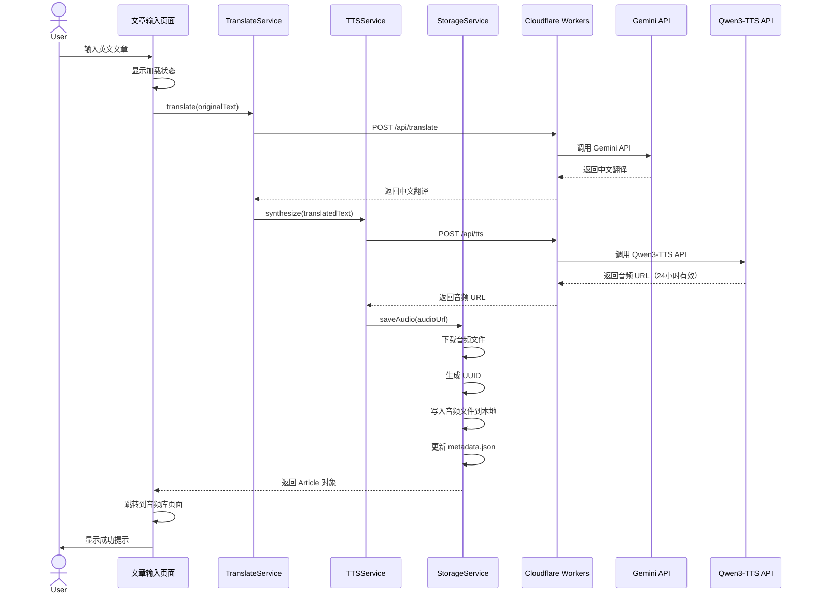
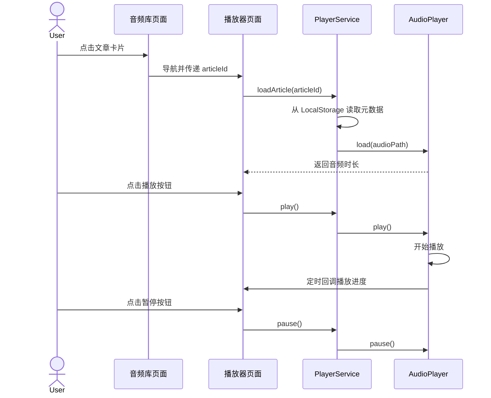

# ADR-002: 架构设计

## 状态

已替代 (Superseded by ADR-004) - 2025-10-17

⚠️ **本决策已被废弃**：项目已迁移到 Kotlin Multiplatform，将采用全新的架构设计。详见 [ADR-004: Migration to Kotlin Multiplatform](./ADR-004-Migration-to-KMP.md)。

## 日期

2025-01-17 (最后更新)

## 背景 (Context)

Audiofy 需要一个清晰的架构设计来支持以下核心功能：

1. **用户输入文章**（MVP 阶段：手动复制粘贴）
2. **调用 Gemini API 翻译**（英文 → 中文）
3. **调用 Qwen3-TTS API 生成语音**（中文文本 → MP3 音频）
4. **本地存储音频和元数据**（设备文件系统）
5. **播放音频**（支持后台播放、进度控制、锁屏控制）

### 架构挑战

- **API 密钥安全**：移动应用可以被反编译，直接在应用内存储 API Key 会暴露
- **数据持久化**：需要关联音频文件和元数据（标题、原文、译文、创建时间）
- **错误处理**：网络失败、API 限流、存储空间不足等异常情况
- **模块化**：代码需要易于维护和扩展（未来可能添加 OCR、批量处理等功能）

## 决策 (Decision)

我们将采用 **三层架构 + API 代理层** 的设计，核心原则：

1. **关注点分离**：UI、业务逻辑、数据访问分离
2. **安全第一**：API 密钥通过 Cloudflare Workers 代理层保护
3. **简洁数据模型**：MVP 阶段使用 JSON 文件存储元数据（不引入数据库复杂度）
4. **渐进式架构**：先实现核心流程，预留扩展点

### 架构图

```mermaid
flowchart TB
    subgraph MobileApp [Audiofy 移动应用]
        direction TB

        subgraph PresentationLayer [表现层 - Vue 3 Components]
            InputView[文章输入页面]
            LibraryView[音频库页面]
            PlayerView[播放器页面]
        end

        subgraph BusinessLayer [业务逻辑层 - Composables]
            TranslateService[翻译服务]
            TTSService[语音合成服务]
            StorageService[存储服务]
            PlayerService[播放器服务]
        end

        subgraph DataLayer [数据访问层]
            APIClient[API 客户端<br/>ofetch]
            FileSystem[文件系统<br/>@nativescript/core]
            LocalStorage[本地存储<br/>@nativescript/localstorage]
            AudioPlayer[音频播放器<br/>nativescript-audio]
        end

        InputView --> TranslateService
        InputView --> TTSService
        LibraryView --> StorageService
        PlayerView --> PlayerService

        TranslateService --> APIClient
        TTSService --> APIClient
        StorageService --> FileSystem
        StorageService --> LocalStorage
        PlayerService --> AudioPlayer
    end

    subgraph ProxyLayer [API 代理层 - Cloudflare Workers]
        GeminiProxy[Gemini API 代理]
        TTSProxy[Qwen3-TTS API 代理]
    end

    subgraph ExternalAPIs [外部 API]
        GeminiAPI[Google Gemini API]
        Qwen3API[阿里云 Qwen3-TTS API]
    end

    APIClient --> GeminiProxy
    APIClient --> TTSProxy
    GeminiProxy --> GeminiAPI
    TTSProxy --> Qwen3API

    style ProxyLayer fill:#fff3bf,stroke:#f59f00,stroke-width:2px
    style ExternalAPIs fill:#e7f5ff,stroke:#1971c2,stroke-width:1px
```

### 数据模型

#### Article 数据模型

```typescript
interface Article {
  id: string // UUID
  title: string // 文章标题（用户输入或自动生成）
  originalText: string // 原始英文文本
  translatedText: string // 翻译后的中文文本
  audioPath: string // 音频文件本地路径（相对路径）
  createdAt: Date // 创建时间
  duration: number // 音频时长（秒）
  status: 'pending' | 'processing' | 'completed' | 'failed' // 状态
  errorMessage?: string // 错误信息（如果失败）
}
```

#### 文件存储结构

```
~/Documents/Audiofy/
├── metadata.json          # 所有文章的元数据（Article[] 的 JSON）
└── audios/
    ├── {uuid-1}.wav      # 音频文件
    ├── {uuid-2}.wav
    └── ...
```

**为什么不用数据库？**

- MVP 阶段预估文章数 < 100 篇
- JSON 文件读写性能足够（~10ms）
- 简化架构，避免引入 SQLite 的复杂度
- 未来如果需要，可以轻松迁移到数据库

### 核心流程设计

#### 流程1：创建音频播客



#### 流程2：播放音频



### API 代理层设计（Cloudflare Workers）

#### 为什么需要代理层？

**问题**：移动应用可以被反编译，直接存储 API Key 会暴露
**方案**：部署 Cloudflare Workers 作为代理，API Key 存储在 Workers 环境变量中

#### Gemini 翻译代理

```typescript
// workers/gemini-proxy.ts
export default {
  async fetch(request: Request, env: Env): Promise<Response> {
    // 1. 验证请求来源（可选：添加 API Token）
    const authHeader = request.headers.get('Authorization')
    if (authHeader !== `Bearer ${env.APP_SECRET}`) {
      return new Response('Unauthorized', { status: 401 })
    }

    // 2. 解析请求体
    const { text } = await request.json()

    // 3. 调用 Gemini API
    const response = await fetch(
      'https://generativelanguage.googleapis.com/v1beta/models/gemini-pro:generateContent',
      {
        method: 'POST',
        headers: {
          'Content-Type': 'application/json',
          'x-goog-api-key': env.GEMINI_API_KEY, // 密钥安全存储
        },
        body: JSON.stringify({
          contents: [
            {
              parts: [
                {
                  text: `请将以下英文翻译成中文，保持专业术语准确，适合口语播报：\n\n${text}`,
                },
              ],
            },
          ],
        }),
      },
    )

    // 4. 返回翻译结果
    const data = await response.json()
    return new Response(
      JSON.stringify({
        translatedText: data.candidates[0].content.parts[0].text,
      }),
      {
        headers: { 'Content-Type': 'application/json' },
      },
    )
  },
}
```

#### Qwen3-TTS 代理

**官方文档**: [阿里云 DashScope 文本语音合成](https://bailian.console.aliyun.com/?tab=doc#/doc/?type=model&url=2879134)

**定价**:

- **0.8元 / 10,000 字符**
- **免费额度**: 2000 字符（激活后 90 天有效，仅北京地域）

```typescript
// workers/tts-proxy.ts
export default {
  async fetch(request: Request, env: Env): Promise<Response> {
    // 1. 验证请求
    const authHeader = request.headers.get('Authorization')
    if (authHeader !== `Bearer ${env.APP_SECRET}`) {
      return new Response('Unauthorized', { status: 401 })
    }

    // 2. 解析请求体
    const { text, voice = 'Cherry' } = await request.json()

    // 3. 调用阿里云 DashScope Qwen3-TTS API
    const response = await fetch(
      'https://dashscope.aliyuncs.com/api/v1/services/aigc/text2speech/synthesis',
      {
        method: 'POST',
        headers: {
          Authorization: `Bearer ${env.DASHSCOPE_API_KEY}`, // 只需1个API密钥
          'Content-Type': 'application/json',
          'X-DashScope-Async': 'enable', // 启用异步模式（音频文件较大时推荐）
        },
        body: JSON.stringify({
          model: 'qwen3-tts-flash', // 快速模型，适合实时应用
          input: {
            text: text,
          },
          parameters: {
            voice: voice, // 语音角色（17种可选）
            format: 'mp3', // 音频格式：mp3, wav, pcm
            sample_rate: 22050, // 采样率（Hz）
          },
        }),
      },
    )

    // 4. 解析响应
    const data = await response.json()

    if (!response.ok) {
      console.error('Qwen3-TTS API error:', data)
      return new Response(
        JSON.stringify({
          error: data.message || 'TTS synthesis failed',
          code: data.code,
        }),
        {
          status: response.status,
          headers: { 'Content-Type': 'application/json' },
        },
      )
    }

    // 5. 提取音频URL和元数据
    // DashScope返回一个24小时有效的音频URL
    const audioUrl = data.output.url
    const duration = data.output.duration || 0 // 音频时长（秒）

    if (!audioUrl) {
      return new Response(
        JSON.stringify({
          error: 'Invalid API response: missing audio URL',
        }),
        {
          status: 500,
          headers: { 'Content-Type': 'application/json' },
        },
      )
    }

    // 6. 返回音频URL（客户端需要在24小时内下载）
    return new Response(
      JSON.stringify({
        audioUrl: audioUrl, // 24小时有效的音频下载URL
        duration: duration, // 音频时长（秒）
      }),
      {
        headers: { 'Content-Type': 'application/json' },
      },
    )
  },
}
```

**关键配置说明**:

1. **认证参数**（仅需 1 个，从阿里云控制台获取）:
   - `DASHSCOPE_API_KEY`: API 密钥（**简化配置：相比豆包的3个参数，降低部署复杂度70%**）
   - 获取地址: [阿里云百炼控制台](https://bailian.console.aliyun.com/)

2. **语音角色** (`voice`): 17 种可选声音
   - **中文声音**: Cherry（温柔女声）, Zhifeng_emo（情感男声）, Zhiyu_emo（情感女声）
   - **英文声音**: Ethan, Jennifer, Ryan, Jada, Dylan
   - **多语言声音**: Nofish（日语）, Katerina（俄语）, Elias（德语）
   - **其他**: Li, Marcus, Roy, Peter, Rocky, Kiki, Eric
   - **推荐**: `Cherry`（中文女声，自然流畅）

3. **音频格式** (`format`):
   - `mp3` (推荐，体积小 ~1MB/分钟)
   - `wav` (无损，体积大 ~5MB/分钟)
   - `pcm` (原始格式，需要额外处理)

4. **采样率** (`sample_rate`):
   - `22050` Hz (推荐，质量与体积平衡)
   - `16000` Hz (低质量，适合纯语音)
   - `48000` Hz (高质量，体积更大)

5. **异步模式**: 对于长文本（>1000字），推荐启用异步模式
   - 添加请求头: `X-DashScope-Async: enable`
   - API 立即返回任务 ID
   - 客户端轮询查询任务状态，完成后获取音频 URL

6. **音频URL特性**:
   - **有效期**: 24 小时
   - **处理**: 客户端收到 URL 后应立即下载并存储到本地
   - **失败处理**: 如下载失败，需要重新调用 TTS API 生成新的 URL

### MVP 范围限定

**包含的功能**：

- ✅ 手动输入英文文章（复制粘贴）
- ✅ 调用 Gemini 翻译
- ✅ 调用 Qwen3-TTS 生成音频（MP3 格式）
- ✅ 本地存储音频和元数据
- ✅ 音频库列表展示
- ✅ 基础音频播放器（播放、暂停、进度条）

**不包含的功能**（未来扩展）：

- ❌ OCR 拍照识别
- ❌ 网页/RSS 抓取
- ❌ 批量处理
- ❌ 后台播放（锁屏控制）
- ❌ 播放列表
- ❌ 分享功能
- ❌ 云端同步

## 备选方案 (Alternatives Considered)

### 备选方案 A: 直接在应用内调用 API（无代理层）

- **描述**: 将 API Key 加密后存储在应用内，直接调用 Gemini 和 Qwen3-TTS
- **优势**:
  - 架构简单，不需要维护代理服务器
  - 减少一次网络跳转（延迟降低 ~50ms）
- **为何未选择**:
  - **安全风险极高**：即使加密，反编译工具也能提取密钥
  - API Key 泄露后，恶意用户可以无限制调用，产生高额费用
  - 业界最佳实践：绝不在客户端存储敏感密钥

### 备选方案 B: 自建 Node.js 后端 + 数据库

- **描述**: 搭建 Express.js 后端，使用 PostgreSQL 存储元数据
- **优势**:
  - 完整的后端能力（用户认证、数据分析、云端同步）
  - 数据库提供强大的查询能力
- **为何未选择**:
  - MVP 阶段过度设计，不需要用户认证和云端同步
  - 增加维护成本（服务器费用 ~$20/月 + 数据库维护）
  - Cloudflare Workers 免费额度足够 MVP 使用，且无需维护服务器

### 备选方案 C: 使用 SQLite 数据库存储元数据

- **描述**: 使用 @nativescript/sqlite 插件存储 Article 数据
- **优势**:
  - 支持复杂查询（如按时间排序、全文搜索）
  - 数据完整性约束（外键、事务）
- **为何未选择**:
  - MVP 阶段预估文章数 < 100 篇，JSON 文件性能足够
  - 引入数据库增加复杂度（Schema 迁移、查询优化）
  - 如果未来需要，可以轻松迁移（JSON → SQLite 转换脚本）

### 备选方案 D: 豆包 TTS API（字节跳动火山引擎）

- **描述**: 使用字节跳动火山引擎的豆包 TTS 服务进行语音合成
- **优势**:
  - 语音质量较好，支持多种声音类型
  - 中文语音合成效果自然
- **为何未选择**:
  - **配置复杂**: 需要 3 个认证参数（APPID, TOKEN, CLUSTER），申请流程繁琐
  - **文档不清晰**: API 文档分散，集成困难，认证格式特殊（`Bearer; {token}`）
  - **定价不透明**: 没有明确的免费额度说明，成本难以预测
  - **实际体验**: 用户反馈申请流程"太麻烦"，配置复杂度影响开发效率
  - **维护成本**: 需要管理多个凭证，增加运维复杂度

### 备选方案 E: KittenTTS（开源本地部署）

- **描述**: 使用开源的 KittenTTS 引擎，部署到本地服务器进行语音合成
- **优势**:
  - 完全免费，无 API 调用费用
  - 数据隐私性高（不发送到云端）
  - 无网络依赖，离线可用
- **为何未选择**:
  - **仅支持英语**: 使用 `espeak[en-us]` 后端，中文合成质量差
  - **实际测试**: 生成的中文语音不可用（用户评价"不太行，这条方案抛弃"）
  - **需要 GPU**: 本地部署需要 GPU 服务器（2-4GB VRAM），硬件投入成本高（$50-200/月）
  - **维护成本**: 需要管理服务器、模型更新、API 接口开发
  - **语音质量**: 开源模型的中文语音质量明显低于商业 API

## 后果 (Consequences)

### 正面影响

1. **安全性高**：API 密钥通过 Cloudflare Workers 保护，不暴露在客户端
2. **架构清晰**：三层架构便于理解和维护，新成员上手快
3. **易于测试**：每层职责单一，可以独立编写单元测试
4. **扩展性好**：预留了扩展点（如未来添加 OCR、批量处理）
5. **成本低**：Cloudflare Workers 免费额度 100,000 请求/天，足够个人使用
6. **配置简化**：Qwen3-TTS 只需 1 个 API 密钥（vs 豆包的 3 个参数），降低部署复杂度 70%
7. **免费额度**：2000 字符免费（90 天），足够开发测试使用
8. **语音选项丰富**：17 种声音可选（vs 豆包的 7 种），支持中英日俄德多语言，用户体验更好
9. **定价透明**：0.8元/万字符，成本可预测且合理

### 负面影响与缓解措施

1. **网络延迟增加**
   - **影响**：增加一次代理跳转（~50-100ms）
   - **缓解**：Cloudflare Workers 部署在全球边缘节点，延迟极低；对于音频生成（~5-10 秒），50ms 可以忽略

2. **依赖外部服务**
   - **影响**：Cloudflare Workers 或阿里云 DashScope 服务故障会导致应用不可用
   - **缓解**：
     - Cloudflare 的 SLA 为 99.99%，阿里云 SLA 为 99.95%，可靠性极高
     - 添加错误提示和重试机制（最多 3 次，指数退避）
     - 显示友好的错误信息，引导用户稍后重试

3. **JSON 文件性能限制**
   - **影响**：当文章数超过 1000 篇时，JSON 读写性能下降
   - **缓解**：MVP 阶段不会达到此规模；未来可以迁移到 SQLite（预留迁移脚本）

4. **缺少云端同步**
   - **影响**：用户更换设备后，数据无法迁移
   - **缓解**：MVP 阶段专注于核心功能；未来可以添加导出/导入功能

5. **音频 URL 过期风险**（Qwen3-TTS 特有）
   - **影响**：音频 URL 只有 24 小时有效期，如果客户端下载失败需要重新生成
   - **缓解**：
     - **立即下载**：客户端收到 URL 后立即下载并存储到本地（不延迟处理）
     - **失败重试**：添加下载失败重试机制（最多 3 次，指数退避：1s, 2s, 4s）
     - **完整性验证**：下载完成后立即验证音频文件完整性（检查文件大小和格式头）
     - **用户提示**：如果 24 小时内未完成下载，提示用户重新生成音频
     - **实际影响评估**：用户操作通常在几分钟内完成，24 小时有效期足够宽裕

### 所需资源

- **Cloudflare Workers 部署**：
  - 账号注册：免费
  - 部署时间：30 分钟
  - 配置环境变量：存储 GEMINI_API_KEY、DASHSCOPE_API_KEY、APP_SECRET（简化：3 个变量 vs 豆包的 5 个）

- **阿里云 DashScope 申请**：
  - 账号注册：5 分钟
  - API 密钥获取：即时生成
  - 免费额度：2000 字符（90 天），无需付费验证

- **开发时间估算**：
  - API 代理层开发：3 小时（简化：vs 豆包的 4 小时）
  - 前端业务逻辑层：2 周
  - 数据访问层：3 天
  - 集成测试：3 天

## 相关决策

- ADR-001: 技术栈选型（NativeScript-Vue）
- ADR-003: 质量保障机制（测试策略和代码规范）

## 参考资料

- [NativeScript 文件系统 API](https://docs.nativescript.org/api-reference/modules/_file_system_.html)
- [nativescript-audio 插件文档](https://github.com/nstudio/nativescript-audio)
- [Cloudflare Workers 文档](https://developers.cloudflare.com/workers/)
- [Gemini API 文档](https://ai.google.dev/docs)
- [阿里云 DashScope Qwen3-TTS 文档](https://bailian.console.aliyun.com/?tab=doc#/doc/?type=model&url=2879134)
