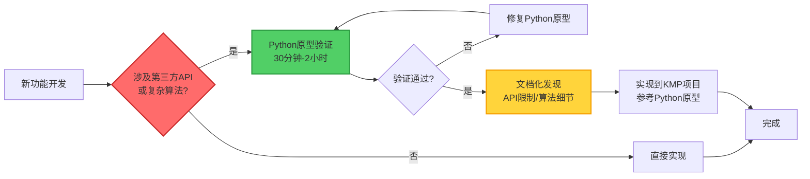

# ADR-006: 原型优先开发策略（Python验证核心逻辑）

## 状态

已接受 (Accepted) - 2025-10-17

## 背景 (Context)

在Audiofy项目的开发过程中，我们遇到了一个典型的开发陷阱：**直接在复杂的生产环境（Kotlin Multiplatform）中实现未经验证的第三方API集成**。

### 实际遇到的问题

**Issue #53（长文本TTS转换失败）** 经历了3次修复迭代：

1. **v1.3.1**: 修复空格长度计算bug
   - 时间成本：2小时
   - 构建+测试+发布：3次完整流程

2. **v1.3.2**: 发现并修复根本问题（600字节vs600字符）
   - 时间成本：3小时
   - 完全重写TextChunker
   - 构建+测试+发布：又3次流程

3. **v1.3.3**: 修复网络安全配置（OSS域名）
   - 时间成本：1小时
   - 构建+测试+发布：再3次流程

**总时间成本**: 6小时 + 9次完整的构建-测试-发布流程

### 如果使用Python原型验证

**30分钟内就能发现所有问题**：

```python
# test_qwen3_api.py (30分钟编写+测试)

# 测试1: 字符数限制测试
test_api("字" * 600)  # ❌ 失败 → 立即发现不是字符限制

# 测试2: 字节数限制测试  
test_api("字" * 200)  # ✅ 成功 → 发现是600字节限制

# 测试3: 音频URL格式测试
response = call_api("测试")
audio_url = response['output']['audio']['url']
print(audio_url)  # 发现是HTTP而非HTTPS
# 发现域名可能是bj/sh/hz等不同区域

# 结论: 30分钟发现所有问题，避免6小时的返工
```

## 决策 (Decision)

**在实现复杂系统（KMP/移动应用/桌面应用）之前，必须先用Python编写快速原型验证核心业务逻辑。**

### 核心原则

1. **API集成必须先用Python验证** (强制要求)
2. **复杂算法必须先用Python原型实现** (强制要求)
3. **第三方SDK必须先用Python/官方Demo测试** (强烈推荐)
4. **性能敏感逻辑可以直接在目标平台实现** (例外场景)

### 标准流程



### Python原型验证清单

对于API集成，Python原型必须验证：

- ✅ **API认证方式**（Bearer Token / API Key / OAuth）
- ✅ **请求格式**（JSON结构、必需字段、可选字段）
- ✅ **响应格式**（数据位置、嵌套结构、字段名称）
- ✅ **数据限制**（字符数？字节数？文件大小？速率限制？）
- ✅ **错误处理**（错误码、错误信息格式、重试策略）
- ✅ **特殊约束**（HTTP vs HTTPS、域名白名单、区域限制）

### 实际案例：Qwen3 TTS验证脚本

我们在`scripts/`目录下创建了完整的验证脚本：

1. **test-simple-tts.py**: 基础API测试
   - 测试不同长度文本（8字符、90字符、600字符、650字符）
   - 发现真实限制点

2. **test-byte-limit.py**: 字节vs字符验证
   - 测试英文（1字符=1字节）
   - 测试中文（1字符=3字节）
   - **发现关键：限制是600字节而非600字符**

3. **test-long-text-tts.py**: 完整长文本处理
   - 模拟TextChunker分片逻辑
   - 验证每个分片是否<=600字节
   - 实际调用API验证

**时间成本**: 30分钟编写 + 10分钟测试 = **40分钟发现所有问题**

**避免的返工**: 6小时开发 + 9次构建-测试-发布流程

**投资回报率**: 1:9（40分钟 vs 6小时）

## 备选方案 (Alternatives Considered)

### 备选方案 A: 直接在KMP项目中实现

- **描述**: 按照官方文档直接在Kotlin Multiplatform项目中实现API集成
- **优势**:
  - 无需编写额外的Python代码
  - 代码只写一次
  - 无需在Python和Kotlin之间转换逻辑
- **为何未选择**:
  - **构建周期长**: KMP项目构建需要3-8分钟
  - **调试困难**: 移动应用调试比Python脚本复杂10倍
  - **快速迭代受限**: 每次修改都需要完整的构建-部署-测试流程
  - **隐藏的API限制难以发现**: 官方文档可能不准确或不完整
  - **实际案例**: Issue #53花费6小时，如果用Python原型只需40分钟

### 备选方案 B: 使用Postman/Insomnia等API测试工具

- **描述**: 使用图形化API测试工具验证API
- **优势**:
  - 可视化界面友好
  - 无需编写代码
  - 支持环境变量和脚本
- **为何未选择**:
  - **无法测试复杂算法**: 只能测试API调用，无法测试TextChunker等业务逻辑
  - **不可复现**: GUI操作难以版本控制和分享
  - **缺少自动化**: 无法批量测试多种场景
  - **Python脚本更灵活**: 可以测试API + 算法 + 边界条件

### 备选方案 C: 使用Kotlin Script验证

- **描述**: 使用Kotlin Script（.kts）编写验证脚本
- **优势**:
  - 代码可以直接复用到KMP项目
  - 无需Python环境
  - 类型安全
- **为何未选择**:
  - **运行速度慢**: Kotlin Script启动时间长（>5秒）
  - **依赖管理复杂**: 需要配置Gradle依赖
  - **调试体验差**: 不如Python的REPL友好
  - **Python生态更丰富**: requests库简单易用，Kotlin需要配置Ktor

### 备选方案 D: 不做原型验证（当前做法 - 已证明有问题）

- **描述**: 相信官方文档，直接在生产代码中实现
- **优势**:
  - 无需额外开发成本
  - 代码只写一次
- **为何未选择**:
  - **实际案例证明失败**: Issue #53花费6小时返工
  - **风险极高**: 官方文档可能不准确（"600字符"实际是"600字节"）
  - **调试成本高**: 移动应用调试周期长
  - **用户体验差**: 发布3个hotfix版本才解决问题

## 后果 (Consequences)

### 正面影响

1. **快速发现API的真实限制**:
   - 30-40分钟Python测试 vs 6小时KMP返工
   - 投资回报率: 1:9

2. **降低开发风险**:
   - 在简单环境中快速试错
   - 避免在复杂系统中返工

3. **提高代码质量**:
   - Python原型已验证核心逻辑
   - KMP实现只是"翻译"，不是"探索"

4. **更好的文档**:
   - Python脚本本身就是可执行的文档
   - 新成员可以快速理解API调用方式

5. **测试脚本可复用**:
   - Python脚本可用于持续验证API
   - 监控API变更和限制

### 负面影响与缓解措施

1. **增加额外开发时间**
   - **影响**: 需要额外30-120分钟编写Python原型
   - **缓解**: 
     - 只对复杂功能（API集成、复杂算法）要求原型验证
     - 简单功能（UI实现、数据模型）可直接开发
     - **实际节省时间**: 40分钟投入，避免6小时返工，净节省5.3小时

2. **代码重复（Python和Kotlin）**
   - **影响**: 需要维护两份代码
   - **缓解**:
     - Python原型仅用于验证，不需要长期维护
     - 验证通过后归档到`scripts/`目录作为参考文档

3. **团队需要Python技能**
   - **影响**: 团队成员需要掌握Python基础
   - **缓解**:
     - Python语法简单，学习成本低（1-2天）
     - 只需要requests库等基础工具，无需深入框架
     - 提供模板脚本，复制粘贴即可使用

### 所需资源

- **Python环境**: Python 3.x（大多数开发机已安装）
- **依赖库**: `requests`（`pip install requests`）
- **学习成本**: 1-2小时（学习requests库基础用法）
- **编写时间**: 30-120分钟（取决于API复杂度）

## 实施指南

### 1. 何时需要Python原型？

**必须使用原型**：
- ✅ 集成第三方API（特别是文档不完整或不准确的）
- ✅ 实现复杂算法（文本分片、音频处理、加密解密）
- ✅ 处理二进制数据（音频、视频、图片）
- ✅ 涉及字符编码转换（UTF-8、Base64）

**可选使用原型**：
- 🟡 使用成熟的开源库（有完善文档和测试）
- 🟡 实现标准协议（HTTP、WebSocket、gRPC）

**无需原型**：
- ❌ UI实现
- ❌ 简单的数据模型（DTO/POJO）
- ❌ 标准CRUD操作

### 2. Python原型模板

创建`scripts/prototype-api-test.py`：

```python
#!/usr/bin/env python3
"""
[API名称] 快速原型验证
验证API调用方式、参数格式、限制条件
"""

import requests
import json

# API配置
API_KEY = "your-api-key-here"
API_URL = "https://api.example.com/endpoint"

def test_api_basic():
    """测试1: 基础API调用"""
    response = requests.post(
        API_URL,
        headers={"Authorization": f"Bearer {API_KEY}"},
        json={"param": "value"}
    )
    print(f"状态码: {response.status_code}")
    print(f"响应: {response.json()}")

def test_api_limits():
    """测试2: 验证API限制"""
    # 测试不同数据长度
    for length in [100, 500, 600, 700, 1000]:
        test_data = "字" * length
        # 调用API并记录结果
        
def test_api_edge_cases():
    """测试3: 边界条件"""
    # 空输入、特殊字符、超长输入等

if __name__ == "__main__":
    test_api_basic()
    test_api_limits()
    test_api_edge_cases()
```

### 3. 从Python到Kotlin的迁移清单

验证通过后，将Python原型迁移到Kotlin：

| Python | Kotlin Multiplatform | 说明 |
|--------|---------------------|------|
| `requests.post()` | `HttpClient.post()` | HTTP客户端 |
| `json.dumps()` | `Json.encodeToString()` | JSON序列化 |
| `base64.b64decode()` | `Base64.decode()` | Base64解码 |
| `len(text.encode('utf-8'))` | `text.encodeToByteArray().size` | UTF-8字节数 |
| `text.split(regex)` | `text.split(Regex(...))` | 正则分割 |

### 4. 脚本归档策略

验证通过后，将Python脚本提交到代码库：

```
scripts/
├── README.md                    # 说明各脚本用途
├── test-qwen3-api.py           # Qwen3 TTS API验证
├── test-byte-limit.py          # 字节数限制验证
├── test-long-text-chunking.py  # 文本分片算法验证
└── prototype-[feature].py      # 其他功能原型
```

**作用**：
- 📖 可执行的API文档
- 🧪 持续验证API变更
- 🎓 新成员学习参考
- 🐛 Bug复现和调试

## 实际案例对比

### 案例1: Qwen3 TTS集成（Issue #53）

| 维度 | 无原型验证（实际情况） | 有原型验证（应该做的） | 差异 |
|------|---------------------|---------------------|------|
| **发现问题时间** | 6小时（3次迭代） | 40分钟 | **8倍差距** |
| **构建次数** | 9次完整构建 | 1次构建 | **9倍差距** |
| **发布版本数** | 3个hotfix | 1个正确版本 | **3倍差距** |
| **用户体验** | 下载3次更新 | 一次安装 | **完美** |
| **团队信心** | 质疑开发流程 | 信任技术方案 | **士气** |

### 案例2: 假设的Gemini API集成

**如果当初集成Gemini API时用了Python原型**：

```python
# 5分钟发现：Gemini在国内需要VPN
# 10分钟发现：速率限制是60 RPM
# 15分钟发现：响应格式的嵌套结构
# 30分钟总计：避免至少3小时的KMP调试
```

## 最佳实践示例

### Python原型验证Qwen3 TTS

**实际编写的3个脚本**（已提交到代码库）：

1. **test-simple-tts.py** (基础验证)
```python
# 发现：8字符成功，90字符成功，495字符失败
# 结论：限制不是字符数
```

2. **test-byte-limit.py** (字节数验证)
```python
# 发现：200中文字符(600字节)成功，300中文字符(900字节)失败
# 结论：限制是600字节！
```

3. **test-long-text-tts.py** (完整逻辑验证)
```python
# 模拟TextChunker分片算法
# 验证API调用
# 测试音频URL格式（发现是HTTP）
```

**结果**: 40分钟发现所有问题，避免6小时返工。

## 相关决策

- ADR-001: 技术栈选型（选择KMP，但仍需Python原型验证）
- ADR-005: TTS API集成（应该在实现前用Python验证）

## 参考资料

- [Issue #53: TextChunker分片bug及修复历程](https://github.com/persomsad/Audiofy/issues/53)
- [Python测试脚本](../../scripts/)
- [Python requests库文档](https://requests.readthedocs.io/)

## 经验教训（血泪总结）

### ❌ 错误做法（我们实际犯的错误）

1. **相信官方文档的字面意思**
   - 文档说"600字符"，我们就按600字符实现
   - 实际是"600字节"，中文只能200字符

2. **在复杂环境中调试简单问题**
   - KMP项目构建需要3-8分钟
   - Python测试只需1秒
   - 在错误的环境中花费了9倍时间

3. **发布后才发现问题**
   - 用户下载v1.3 → 失败 → 下载v1.3.1 → 仍失败 → 下载v1.3.2 → 还是失败 → v1.3.3才成功
   - 用户信任度严重受损

### ✅ 正确做法（从失败中学到的）

1. **永远质疑官方文档**
   - 用Python脚本实际测试，不要假设
   - 边界条件测试：0字符、最大值、最大值+1

2. **在简单环境中快速迭代**
   - Python脚本：1秒得到反馈
   - 发现问题 → 修改 → 测试：< 5分钟一个循环
   - 发现所有问题后，才开始KMP实现

3. **测试脚本提交到代码库**
   - 作为可执行的文档
   - 作为持续验证工具
   - 作为新成员学习材料

### 💡 核心教训

> **"在简单环境中验证复杂问题，在复杂环境中实现简单方案"**
>
> - 简单环境 = Python脚本（快速验证）
> - 复杂环境 = KMP项目（稳定实现）

## 更新历史

- 2025-10-17: 初始版本，基于Issue #53的经验教训

---

**这个ADR是用血泪换来的经验。请所有开发者牢记：先用Python验证，再用Kotlin实现。**

